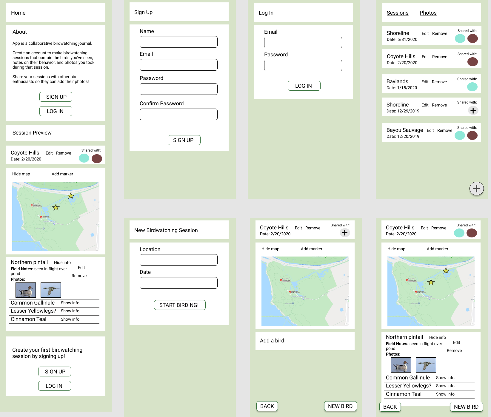

# Final Project: MERN-stack web app
## Sandpiper, a collaborative birdwatching journal
By Judy Kim, SEI '10

https://sandpiper-react.herokuapp.com/  
Sandpiper is an app where you can keep track of the birds you saw and the photos you took of them. You can share entries, or birding sessions, with other users that went birding with you. This lets users compile the photos that might have otherwise lived on separate devices in the same spot. Sandpiper works best in Chrome, Firefox, Edge, and currently doesn't work in Safari for some reason.

Sandpiper uses a multi-server architecture. The backend API is deployed to its own Heroku site and was built with Node.js, Express, and MongoDB.

## Technologies Used
* React 
* Express
* Node.js
* MongoDB

Front-end: React, React Hooks, Bootstrap, Flexbox, Font Awesome, Javascript, CSS, HTML  
Back-end: Express, Node.js, MongoDB, Mongoose
Dependencies: Axios, Bing Maps, Cloudinary, React Router

### Backend API
* Github: https://github.com/kimjudyh/sandpiper-api
* Deployed Site: https://sandpiper-api.herokuapp.com/

## Screenshots
Sandpiper is responsive to mobile device screens. Shown below is the profile page, which lists all birding sessions, and an individual birding session page.

 

Any session can be shared with a user that has signed up for Sandpiper. The birding session contains a map. In future work, the user will be able to drop pins and utilize photo metadata.

 

Photos and field notes can be added to each bird in a birding session. All photos can be viewed and sorted on a separate page.

 

Desktop versions of the profile and photos page.

## Features
* Share a birding session with registered users
* Add photos to a specific bird in a birding session
* View all photos you've added, and that have been shared with you, and sort them by date uploaded, birding session, bird, or behavior
### Future Work
* Expand the use of maps to let users drop pins and use photo metadata to determine the birding session's location
* Add more sorting options for photos
* Add a birds seen checklist that show all birds recorded in birding sessions

## Data Models
The backend uses 5 models:
1. User
2. BirdingSession
3. Bird
4. Photo
5. Behavior

## Wireframes
Wireframes were made in Figma. A mobile-first approach was taken when designing the wireframes.

## Known Issues
* App can't make API requests to back-end in Safari
* Timezone conversion issue between UTC and local timezone
* On the photos page, if you sort the photos, then delete a photo, the Sorted By form doesn't reset to the default choice

This project was bootstrapped with [Create React App](https://github.com/facebook/create-react-app).

